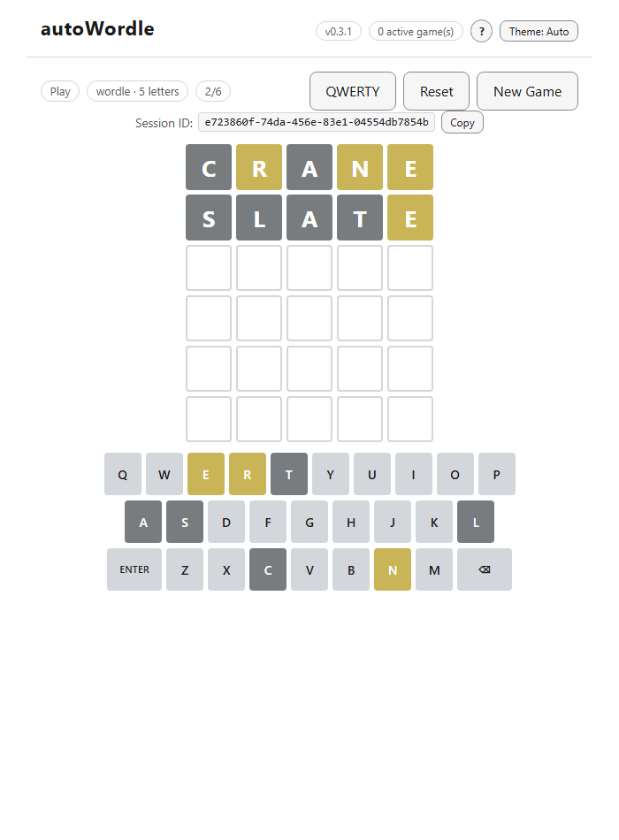
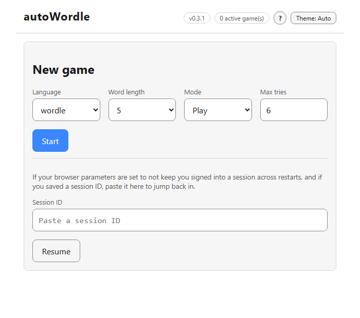
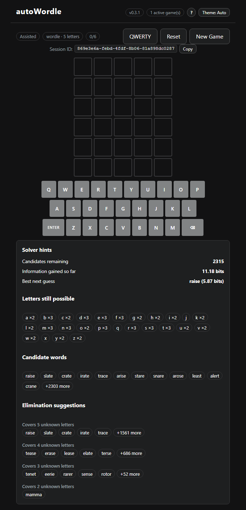

# autoWordle

Ever heard of [Wordle](https://en.wikipedia.org/wiki/Wordle)? No? And here I though I was living under a rock... Anyway, for some reasons, 2 years after watching [3b1b](https://www.3blue1brown.com/lessons/wordle)'s video about it, that topic decided to crawl its way up from the depth of my memory.

I had a couple of goals this time around:
- Try to make an "efficient" solver (reasonably fast, with a low impact on the RAM, and reasonably accurate)
- Allow some room for customisation (word length, language, number of tries, game modes, ...)
- Make it a WebApp that can handle multiple sessions (using pure HTML, CSS, JS to avoid extra dependencies and the need to maintain them every other month)

It's still a "work in progress" as of now... And there is a lot of room for improvement.



## VERSION

The current version lives in [pyproject.toml](pyproject.toml) and is read from package
metadata at runtime. See [CHANGELOG.md](CHANGELOG.md) for the full version history.

## TABLE OF CONTENT

<!-- TOC -->

- [autoWordle](#autowordle)
  - [VERSION](#version)
  - [TABLE OF CONTENT](#table-of-content)
  - [TL;DR](#tldr)
  - [ARCHITECTURE](#architecture)
  - [THE SOLVER](#the-solver)
  - [PROJECT LAYOUT](#project-layout)
  - [API](#api)
  - [INSTALLATION](#installation)
  - [PLAYING THE GAME](#playing-the-game)

<!-- /TOC -->

## TL;DR

"I don't want to install anything or read anything, just make it quick and easy please." I hear you say? Sure, just click [here](https://autowordle.onrender.com) and have fun. 

## ARCHITECTURE

autoWordle is a [FastAPI](https://fastapi.tiangolo.com/) backend. Game
sessions are persisted to a SQLite file (`data/sessions.sqlite`, WAL mode -
the same approach already used for the pattern-compendium cache), not an
in-memory dict, so they survive app restarts and work correctly across
multiple `uvicorn` workers; they're garbage-collected after
`SESSION_TTL_SECONDS` of inactivity (see `config.json`). The app serves
`frontend/` as static files, if present - a plain HTML/CSS/JS app with no
build step (native ES modules), so nothing needs installing or compiling to
run it.

Logging goes through the stdlib `logging` module (rotating file +
console, configured once in `autoWordle/app/logging_utils.py` from
`config.json`'s `logging_level`), not bare `print()` - the log format
includes `%(funcName)s`, so there's no need for the
`inspect.currentframe().f_code.co_name` dance the codebase used to do just to
know which function logged a message.

Every API route is rate-limited per client IP (an in-memory sliding window,
independent per `uvicorn` worker - it's blunting abusive bursts, not
metering an exact global quota) - `DEFAULT_RATE_LIMIT_PER_MINUTE` (default
`60`) for the API as a whole, and a stricter `PRECOMPUTE_RATE_LIMIT_PER_MINUTE`
(default `5`) specifically for `POST /precompute`, since a build can run for
minutes of real CPU time. Both are optional `config.json` keys; omitting them
keeps the defaults.

```
autoWordle/                  # the installable package
├── main.py                  # FastAPI app factory (composition root)
├── app/                      # session/app-state domain + cross-cutting utilities
│   ├── models.py              # session/app-state management
│   ├── session_store.py        # SQLite-backed persistent session store
│   ├── precompute_store.py      # SQLite-backed precompute job progress/queue/lock
│   ├── display.py                # pure display-formatting helpers (models companion)
│   ├── schemas.py                 # core Pydantic domain models (config, app sources, session state)
│   ├── logging_utils.py            # logging setup (rotating file + console)
│   └── paths.py                   # app-root resolution (AUTOWORDLE_APP_ROOT)
├── webapp/                   # FastAPI web transport layer - the only part that imports fastapi
│   ├── api_views.py            # routes (/api/app/...)
│   └── api_schemas.py           # HTTP request/response contracts
└── modules/                  # core game/solver engine - no FastAPI dependency
    ├── statics.py              # enums, pattern<->emoji conversion
    ├── helpers.py               # LangLauncher, per-language orchestration
    ├── word_codec.py             # word-list/int-codec/CSV I/O (helpers companion)
    ├── wordle.py                 # per-session game/solver state
    ├── computing.py              # pattern/candidate-pool algorithms
    ├── vectorized_compendium.py    # numpy-vectorized compendium/cache streaming (helpers companion)
    ├── entropy.py                 # entropy ranking + ProcessPoolExecutor (computing companion)
    └── compendium_cache.py        # SQLite pattern cache
```

`config.json` and `data/` live outside the package, at the repository root -
they're runtime/user data (including multi-hundred-MB generated caches under
`data/`), not code, so they aren't bundled into an installed package.

## THE SOLVER

Guessing narrows down the pool of candidate words by pattern (⬛/🟨/🟩). For
a given word list, autoWordle can precompute, once:
- a **pattern compendium**: every `(guess, word)` pair bucketed by the
  pattern it produces, cached in SQLite (one table per pattern - benchmarked
  against a single indexed table, and consistently smaller/faster: a
  secondary index would duplicate the pattern value across millions of rows,
  which per-pattern tables never need to store at all)
- an **entropy ranking** of every word (bits of information gained, i.e. how
  much a guess is expected to narrow the pool down) - this is what powers
  the "best opening word" suggestion

Computing this is `O(n**2)` in the word count either way, but *how* it's
built matters a lot for both memory and speed. `vectorized_compendium`
streams every `(guess, word)` pair straight to the SQLite cache in bounded
batches (never materializing the full pair set in memory at once, unlike
`legacy_compendium.build_pattern_compendium`), and computes each guess's pattern
against the *entire* pool as a handful of vectorized numpy array operations
rather than one Python-level function call per pair. Benchmarked against the
straightforward full-compendium-in-memory approach: for the bundled
2315-word `wordle.txt` list, same wall time but ~10x lower peak RSS (~800MB
down to ~80MB); for a 7452-word list at `word_length=6`, ~2x faster *and*
~40x lower peak RSS (~6GB down to ~140MB) - the gap widens with pool size,
since vectorization amortizes better the more pairs there are.

This is only computed for the bundled 5-letter `wordle.txt` answer list by
default (see `data/wordle_5_compendium.sqlite`/`data/wordle_5_info.csv`) -
it's still `O(n**2)` in time, so it's not triggered automatically for the
much larger `en.txt`/`fr.txt` dictionaries. Besides the manual CLI command
(see [INSTALL.md](INSTALL.md#regenerating-solver-data-for-a-new-languageword-length)),
it can now also be triggered on demand through `POST /precompute`
(`{"lang", "word_length"}`), which runs the build in the background and
returns immediately with the job's status (`running`/`queued`) and, if
queued, its position; live progress (`% complete`, ETA) streams over
Server-Sent Events from `GET /precompute_progress?lang=...&word_length=...`
until the job finishes. Since this app can run multiple `uvicorn` workers,
`app/precompute_store.py` (SQLite-backed, same reasoning as the session
store) tracks job state across all of them: it never builds the same
`(lang, word_length)` twice, caps global concurrency at one build at a time
(two heavy numpy builds would only fight over the same cores), and queues
everything else, handing off to the next queued job as each one finishes.

`GAME_MODE_PLAY` only ever needs the plain word list (no precomputed data
required); `GAME_MODE_SOLVE`/`GAME_MODE_ASSISTED` need the exhaustive data
above for whichever language/word length was requested.

## PROJECT LAYOUT

- `autoWordle/` - the package (see [ARCHITECTURE](#architecture))
- `data/` - word lists and generated solver-data sidecars (gitignored)
- `scripts/` - manual/dev tools, not part of the installed package or test suite:
  - `benchmarks/testouille_wordle.py`: self-play benchmark harness (win-rate/attempt stats)
  - `benchmarks/benchmark_compendium.py`: before/after timing & size benchmarks
    for the pattern-compendium/entropy pipeline
  - `profiling/read_profile.py`: generic cProfile `.prof` report reader/summarizer
- `tests/` - pytest suite, runs against a tiny synthetic word list
  (`tests/data/mini.txt`), never the real `data/` files
- `frontend/` - pure JS/HTML/CSS frontend, no build step; served directly by
  the backend (see [ARCHITECTURE](#architecture))

## API

All routes are under `/api/app/` (see `autoWordle/webapp/api_views.py`); interactive
docs are served at `/docs` once the app is running. Every response has a
`status` (`SUCCESS`/`ERROR`/...) and `error` field.

| Route | Method | Purpose |
|---|---|---|
| `/version` | GET | Report the running app version |
| `/get_active_games` | GET | Garbage-collect expired sessions, report the active count |
| `/get_app_sources` | GET | Report available languages/word lengths |
| `/create_game_session` | POST | Start a session (`lang`, `word_length`, `max_tries`, `game_mode`) |
| `/reset_game_session` | POST | Reset a session to a fresh state |
| `/delete_game_session` | POST | Delete a session |
| `/get_game_session_stats` | POST | Report a session's mode/tries/guesses/patterns |
| `/get_word_to_guess` | POST | Reveal the hidden word (solve/assisted modes) |
| `/get_guess_stats` | POST | Elimination/solver statistics for a guess (solve/assisted modes) |
| `/submit_guess` | POST | Submit a guess, get back its emoji pattern (play mode) |
| `/precompute` | POST | Trigger (or join) an exhaustive-data build for `lang`/`word_length` |
| `/precompute_progress` | GET | SSE stream of a precompute job's live progress/ETA until it finishes |

## INSTALLATION

See [INSTALL.md](INSTALL.md) for Windows/Debian/Ubuntu/Arch setup instructions.

## PLAYING THE GAME

Once the app is running (see [INSTALL.md](INSTALL.md#running-the-app)), open
`http://127.0.0.1:10000/` (or wherever the server is bound) in a browser -
the backend serves the frontend directly, nothing else to start or build.

**Setup screen**: pick a language, word length, game mode, and max tries,
then Start.



- `GAME_MODE_PLAY`: the classic game - guess the hidden word within the
  allotted tries.
- `GAME_MODE_ASSISTED`: same as Play, plus a live solver-hints panel
  (candidates remaining, best next guess, elimination suggestions) after
  every guess.

  

- `GAME_MODE_SOLVE`: for solving an *external* puzzle (paper, another site,
  a friend) rather than one this app generated - enter a guess and manually
  set the pattern it produced, and the solver narrows the candidate pool
  down for you from there.

Solve/Assisted need the exhaustive solver data described in
[THE SOLVER](#the-solver). If it isn't built yet for the language/word
length picked, the setup screen offers a "Build solver data" button with a
live progress bar instead of blocking Start outright - the same job as
`POST /precompute` (see [API](#api)).

**Sessions** persist across page reloads via the browser's `localStorage`,
and are resumed automatically. If the browser doesn't keep that (e.g.
cleared on close), every game screen shows its session ID with a copy
button - paste it into the "Resume a session" box on the setup screen to
pick up where you left off, as long as the session itself hasn't since
expired (`SESSION_TTL_SECONDS` in `config.json`, 30 minutes of inactivity
by default).

The on-screen keyboard (Play/Assisted) can be toggled between QWERTY and
AZERTY layouts - purely cosmetic rearrangement of the clickable keys;
physical typing already follows whatever layout the OS/keyboard is set to,
regardless of this toggle.

The `Theme: Auto/Light/Dark` button in the header cycles a manual color
theme override, stacked on top of the automatic `prefers-color-scheme`
detection (`Auto`, the default, always follows the OS/browser setting). The
choice persists in `localStorage` across reloads. The app is also
installable (manifest + icon, `frontend/manifest.json`) via the browser's
"Install app"/"Add to Home Screen" prompt, for quicker launching - it still
needs the backend to be reachable to do anything, so this isn't offline
support.
